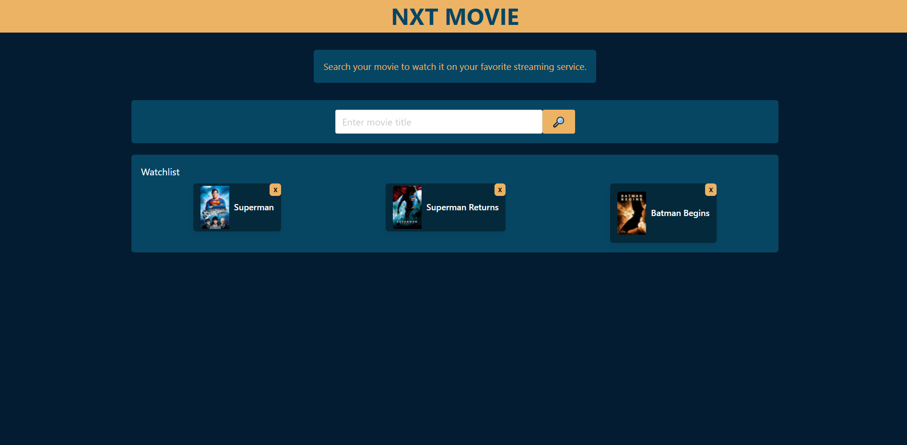

# NXT-movie

by Cesar San, [Isaac Galvan](https://github.com/isaacgalvan10) and [Ernest1589](https://github.com/ernest1589)
Contact me by Email: cesanchezesc@gmail.com

List of Technologies:

-HTML.

-CSS.

-SCSS.

-Bulma.

-Javascript.

-APIs.

NXT movie is an app to look for a movie and get the streaming services you can use to watch it.

This is a team project that required the use of all the technologies and skills that have been adquired so far.

The requirement were:

-Use a CSS framework other than Bootstrap.
-Be deployed to GitHub Pages.
-Be interactive.
-Use at least two server-side APIs.
-Use modals from interactions
-Use client-side storage to store persistent data.
-Be responsive.
-Have a polished UI.
-Have a clean repository.
-Have a quality README.

After deciding what type of application and APIs were going to be used, the tasks were assigned and the development started. 

The application was designed to help users search for a movie, see the trailer, see on what streaming platform that movie is available on, and can create a watchlist of movies the user would like to watch next. 

It was made using Bulma as a CSS Framework, HTML, CSS and Javascript. Two APIs were used, one for searching for movies and the other to get streaming information. 

The main challenges as working as a team were related to the use of Github and some difficulties with the assignment of tasks.

Finally, a working application was debugged, checked and finally deployed.

 [Final Product:Github repository](https://github.com/csancheze/Nxt-Movie-project/)

 [Final Product:Nxt movie](https://csancheze.github.io/Nxt-Movie-project/)

[Document Presentation](https://onedrive.live.com/view.aspx?resid=124BCA53E6F59F19!82298&ithint=file%2cpptx&authkey=!AHVscf0fYc7J3lQ)

Copyright (c) [2022] [Cesar San, Isaac Galvan and Ernest1589]

Permission is hereby granted, free of charge, to any person obtaining a copy of this software and associated documentation files (the "Software"), to deal in the Software without restriction, including without limitation the rights to use, copy, modify, merge, publish, distribute, sublicense, and/or sell copies of the Software, and to permit persons to whom the Software is furnished to do so, subject to the following conditions:

The above copyright notice and this permission notice shall be included in all copies or substantial portions of the Software.

THE SOFTWARE IS PROVIDED "AS IS", WITHOUT WARRANTY OF ANY KIND, EXPRESS OR IMPLIED, INCLUDING BUT NOT LIMITED TO THE WARRANTIES OF MERCHANTABILITY, FITNESS FOR A PARTICULAR PURPOSE AND NONINFRINGEMENT. IN NO EVENT SHALL THE AUTHORS OR COPYRIGHT HOLDERS BE LIABLE FOR ANY CLAIM, DAMAGES OR OTHER LIABILITY, WHETHER IN AN ACTION OF CONTRACT, TORT OR OTHERWISE, ARISING FROM, OUT OF OR IN CONNECTION WITH THE SOFTWARE OR THE USE OR OTHER DEALINGS IN THE SOFTWARE.
